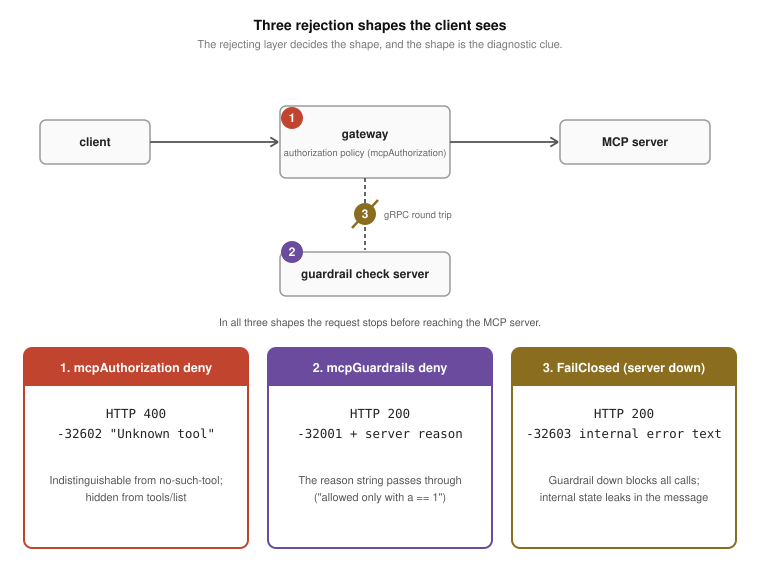
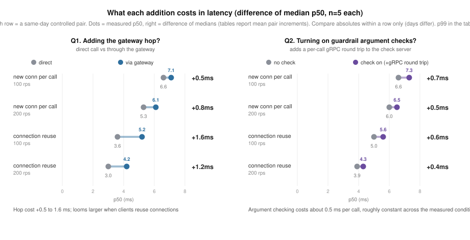

# agentgateway-study: what the gateway actually enforces and observes for MCP

[한국어](README_ko.md)

This study measures the distance between what the agentgateway documentation
says and what the gateway actually enforces and observes when it fronts MCP
(Model Context Protocol) servers. Instead of reading feature tables, I
verified behavior: what CEL authorization policies block, what they silently
block by mistake, how far trace context travels, what putting the gateway
in the path costs, and what argument-level control actually takes when the
policy path cannot do it. It applies the "declared versus enforced" frame from
[gateway-PoC](../gateway-PoC) to an MCP gateway.

agentgateway is an Agentic AI Foundation (AAIF) project at the Linux
Foundation. The target is agentgateway v1.4.1 in Kubernetes mode, with the new-spec
(2026-07-28) MCP server built in [mcp-migration](../mcp-migration) as the
backend.

## TL;DR

- **The cost is small.** Going through the gateway adds 0.5 to 1.6 ms at
  p50, small next to the work a tool call actually does (tens of
  milliseconds to seconds), and adding argument checks (guardrail) costs about 0.5 ms per
  call, roughly constant across the measured loads and connection modes.
- **In exchange, the gateway enforces what an MCP server cannot do per client:** tool
  exposure control (list filtering), argument-level control, and distributed
  tracing without touching the servers.
- **But some policies are accepted without being enforced as written.** An
  argument-conditioned policy that locks the whole backend while reporting
  healthy is the core finding. Turn a policy on, then verify it with real
  calls.

## Findings

1. **A tool-name allowlist blocks calls and filters the list.** With a policy
   allowing only `echo`, calls to other tools are rejected with 400 and the
   tools disappear from `tools/list`. The rejection is not an authorization
   error but `"Unknown tool"` (-32602). The code comes from the JSON-RPC
   standard that MCP inherits, and -32602's standard meaning is "invalid
   params", so a permission denial is reported with an argument-error code.
   It is a deliberate design that makes blocked
   tools look nonexistent (anti-enumeration, discussed in upstream #758). The
   cost is that a client cannot tell "no permission" from "no such tool".
2. **A policy that conditions on tool arguments is accepted, then locks the
   whole backend.** This is the core finding. A rule like
   `mcp.tool.arguments.a == 1` passes validation (`Accepted`) and reports
   healthy status. But the authorization-time CEL context has no tool
   arguments, so the condition can never evaluate, and since
   `matchExpressions` is an allowlist, every call is rejected, including calls
   that satisfy the written condition. Under this rule `tools/list` returns an empty
   list, and the natural `has(...)` guard lifts the lockout but
   short-circuits for every call, so the rule evaluates on the name only and
   the argument condition never applies (`a=2`, which the rule meant to
   block, passes; measured). So within this policy
   path there is no workaround for argument-level control: the operator
   believes it is in place, and what they actually have is every call
   blocked, or a vanished condition. Upstream status (as of 2026-08-27): the
   identity-only authorization context is itself a design choice (the policy
   applies to both tools/list and tools/call, and no arguments can exist at
   list time; the maintainer filed #2069 with an improvement proposal,
   pending decision). The architecture docs state the limitation, but the
   user-facing schema docs do not mark the phase; this study reported the
   gap as #3092, and a community PR (#3127) that adds a warning to those
   docs is open. This description applies to the measured version, v1.4.1;
   the same behavior was confirmed on v1.5.0-beta.1 and main.
3. **Policies evaluate the original tool name, and renaming is not a
   bypass.** Across all three prefixMode settings, no renamed (prefixed) name such as
   `mcp-b-80_echo` slipped past a block. Two traps instead: writing the policy against the renamed
   name that clients actually see in `tools/list` produces the same total
   lockout as finding 2, and a name the policy allows reaches the server even
   if the tool does not exist there, failing as 200 + isError rather than the
   gateway's 400.
4. **Rule count does not affect latency at this scale.** With 0, 1, and 21
   rules, median p50 stayed within 5.8 to 7.2 ms and every run held the
   offered rate (lowest 197.3 of 200).
5. **traceparent crosses the gateway and lands in `_meta` too.** The
   downstream server receives a traceparent header with the client's trace-id
   preserved and the gateway's own span-id, and the same value injected into
   `params._meta.traceparent`, the spot the MCP spec reserves (5 out of 5
   probes). I did not find this behavior in the v1.4.1 documentation. I
   measured with gateway tracing not
   configured; the span-parenting issue in the tracing-enabled path was
   reported upstream as #2904, and the fix is merged and ships in a release
   after the measured v1.4.1.
6. **The gateway costs 0.5 to 1.6 ms at p50 depending on how clients
   connect, and its tail effect flips with the connection mode.** With a new
   connection per call, p50 rose by 0.5 to 0.8 ms while median p99 was lower
   through the gateway. With connection reuse, the cost grew to 1.2 to
   1.6 ms and the p99 advantage disappeared (tables below). This points to
   connection churn: the gateway's tail benefit comes from absorbing
   connection churn at its own layer, so when clients reuse connections only
   the extra hop remains. Both paths held the offered rate with zero errors
   in every cell.
7. **Argument-level control works through mcpGuardrails (an external gRPC
   policy server).** A minimal server enforcing "get-sum only when a == 1"
   passed a=1, denied a=2, and passed unrelated tools; the gateway ships the
   tool arguments to the gRPC server verbatim. Unlike the authorization
   path, the denial comes back as HTTP 200 with a JSON-RPC error carrying
   the server's own reason string, and when the policy server is down the
   FailClosed default blocks every tools/call while FailOpen lets calls
   through, both as documented. The guardrail hop costs 0.4 to 0.7 ms at p50
   per call, roughly constant across the measured loads and both connection
   modes (zero gateway errors in every cell; table below), and the `Full`
   phase setting routes both the request and the response body
   through the gRPC server.

## What an operator writing policies should know

| Intent | Works? | Caveat |
|---|---|---|
| Tool-name allowlist | Yes | List filtering comes with it. Rejection is 400 + "Unknown tool" (-32602), not an authorization error |
| Argument-based control ("block delete, but only for prod") | Not via policy; yes via guardrail | The policy is accepted while the backend locks up, and a `has(...)` guard drops the condition. mcpGuardrails works but means building a gRPC server yourself, adds about 0.5 ms at p50 per call, and its denial surfaces as 200 + a JSON-RPC error |
| Policies under renaming (prefixMode) | Yes | Always write the original name. Using the prefixed name clients see locks everything out |
| Adding rules and worrying about latency | No need | No difference up to 21 rules |
| Distributed tracing | Yes | Propagated in both the header and `_meta` (verified with tracing not configured) |

The error codes in the figure follow the JSON-RPC standard. -32602 (invalid
params) and -32603 (internal error) are standard codes; -32001 sits in the
band the standard leaves to implementations (-32000 to -32099), a value
agentgateway chose, so generic JSON-RPC knowledge alone does not decode it.

Most of the time these responses are read by an agent loop, not a person:
the LLM consumes the denial text as a tool result and decides its next
move. An agent that receives shape 1, which is indistinguishable from a
missing tool, may conclude the tool does not exist and route around it,
while shape 2's reason string gives it grounds to fix the arguments and
retry. A guardrail's denial reason therefore works as input the LLM reads,
in effect a prompt. Agent behavior itself was not measured in this study;
this paragraph is the interpretation I act on.

## Numbers

Environment: 3-node VirtualBox Kubernetes v1.36.2 (MacBook Pro M4 Pro),
agentgateway v1.4.1, backend at 1 replica, echo tool, 30-second runs;
connection mode and cooldowns are stated per table (60 s between rule-count
repetitions, 180 s between A/B and guardrail cells).
Absolute numbers are
from a virtual environment; read them comparatively.

Latency by rule count (median of 5 runs each):

| Rules | 100 rps p50 | 200 rps p50 |
|---|---|---|
| 0 | 7.2 ms | 5.8 ms |
| 1 | 6.9 ms | 6.4 ms |
| 21 | 6.9 ms | 6.3 ms |

Gateway versus direct (median of 5 runs each). The gateway control plane and
proxy stayed installed while both arms ran, so resource conditions were
identical and the only difference between arms was the load generator's
target address. The two arms alternated within each repetition:

| Path | Offered rps | Achieved | p50 | p99 | Errors |
|---|---|---|---|---|---|
| direct | 100 | 100.0 | 6.6 ms | 21.6 ms | 0 |
| gateway | 100 | 100.0 | 7.1 ms | 17.9 ms | 0 |
| direct | 200 | 200.0 | 5.3 ms | 23.2 ms | 0 |
| gateway | 200 | 200.0 | 6.1 ms | 12.6 ms | 0 |

The same comparison with connection reuse instead of close mode:

| Path | Offered rps | Achieved | p50 | p99 | Errors |
|---|---|---|---|---|---|
| direct | 100 | 100.0 | 3.6 ms | 9.7 ms | 0 |
| gateway | 100 | 100.0 | 5.2 ms | 17.4 ms | 0 |
| direct | 200 | 200.0 | 3.0 ms | 10.2 ms | 0 |
| gateway | 200 | 200.0 | 4.2 ms | 12.8 ms | 0 |

The lower p99 through the gateway in close mode, and its disappearance
under reuse, point to the gateway layer absorbing the connection churn; I
did not attribute it in source.

Guardrail overhead. The gateway and the guardrail pod stayed installed in
both arms and only the policy routing tools/call through the gRPC server
changed. To keep time drift out of the increment, each repetition measured
off and on back to back (odd repetitions off first, even repetitions on
first). Five pairs each:

| Connection | Offered rps | Achieved | off p50 | on p50 | off p99 | on p99 | Mean pair increment |
|---|---|---|---|---|---|---|---|
| new per call | 100 | 100.0 | 6.6 ms | 7.3 ms | 16.5 ms | 17.7 ms | +0.66 ms (sd 0.09) |
| new per call | 200 | 200.0 | 6.0 ms | 6.5 ms | 12.6 ms | 12.7 ms | +0.46 ms (sd 0.05) |
| new per call | 400 | 239 to 315 | 3.8 ms | 4.3 ms | 22.0 ms | 37.0 ms | +0.56 ms (sd 0.05) |
| reuse | 100 | 100.0 | 5.0 ms | 5.6 ms | 14.4 ms | 20.0 ms | +0.38 ms (sd 0.36) |
| reuse | 200 | 200.0 | 3.9 ms | 4.3 ms | 13.5 ms | 12.6 ms | +0.40 ms (sd 0.19) |

A caveat on the 400 rps row: the load generator saturated there, shedding
about 16% of requests and achieving 239 to 315 rps, so that row measures a
higher-throughput saturated condition rather than a clean 400 rps. Its pair
increment still matched the other cells. Another open observation: p50 drops
as the rate rises across several tables (for example 6.6 to 6.0 to 3.8 ms
here); batching under higher concurrency is a plausible cause, and this was not
investigated.

Three readings. First, the latency cost of argument checking is **0.4 to
0.7 ms per call, roughly constant across the measured loads and both
connection modes**. Second, raising the load from 200 rps to an achieved 239
to 315 rps does not grow the increment, which does not fit queueing. Third,
the size and the constancy match
the attribution measurements: during 3,000 close-mode calls the number of
new TCP connections to the check server was one, the same as an idle
baseline, and the v1.4.1 source routes checks over a shared client pool, so
the cost is one round trip over a maintained gRPC channel rather than
per-call channel setup.

One methods note. Before interleaving, sequential-arm runs (all off cells,
then all on cells) painted a different picture: about +1 ms in close mode
and nothing distinguishable from zero under reuse. That contrast did not
reproduce under interleaving. Time drift between arms had inflated one
increment and masked the other, and the interleaved numbers above are the
canonical ones. The lesson: comparisons whose difference sits below 1 ms
need paired interleaving, not sequential arms.

## What was measured

- **Policy enforcement (P0 to P4)**: no-policy baseline, allowlist
  enforcement and list filtering, three probes against the argument-condition
  policy (condition true, condition false, unrelated tool), the full matrix
  of three prefixMode settings x two policy name forms x four call names, and
  rule count x offered rate x 5 repetitions. Follow-up probes covered
  `tools/list` under the argument rule and two `has(...)` guard variants.
- **Observability (T1/T2)**: a tap proxy behind the gateway recorded the
  exact traceparent header and `params._meta` the downstream server receives
  (5 probes).
- **Gateway versus direct (A/B)**: 20 cells against the same backend with
  only the target address changed, then the same 20 cells with connection
  reuse instead of close mode.
- **Alternative path for argument control (axis 3)**: a minimal ExtMcp gRPC
  policy server (`k8s/guardrail/`) verified argument-level enforcement, the
  denial shape, FailClosed and FailOpen behavior, the request-and-response
  routing of the `Full` phase setting, and the latency overhead of the
  guardrail hop.
- **Replay**: the full policy-and-observability harness was re-run once end
  to end; findings 1 through 5 reproduced with no contradictions.
- Two integrity notes. A mid-run process kill during the rule-count cells
  was resumed for the remaining 6 cells with the gateway and policy
  configuration kept identical. And the first verdict on trace propagation
  was a false negative caused by a probe-tool defect; after fixing the
  probe, the valid re-measurement reversed the verdict to "propagated".
  Both are recorded internally together with the raw data.

## Limits

- Only the MCP surface was measured. The same gateway also fronts A2A, LLM
  inference, REST, and gRPC; none of those paths were tested.
- One backend with a small tool set (8 tools). List-filtering cost on large
  tool sets was not measured.
- Among the alternative paths to argument-level control, mcpGuardrails was
  verified (finding 7); extAuthz and extProc were not.
- Within the MCP surface, authentication (MCP Auth) is also out of scope.
- Absolute latency numbers are VirtualBox values.
- The tracing-enabled path (span export) was not measured.

## Reproduction

Run `harness/run_axes.sh` (policy and observability),
`harness/t1p3_addendum.sh` (follow-up), `harness/run_ab.sh` (gateway versus
direct), and `harness/gr_matrix.sh` (guardrail overhead, interleaved) in
that order. The guardrail policy server lives in `k8s/guardrail/`. Raw run
outputs (`runs/`) are not included in this repository; the tables above
document every published number, and `harness/chart.py` regenerates the
figures from raw runs if you produce your own. Prerequisites are the cluster and new-spec
server deployment from [mcp-migration](../mcp-migration); gateway install and
removal reuse the scripts under its
`studies/stateless-scaleout/k8s/agentgateway/`. Each script removes
the gateway after measuring, returning the cluster to its original state.

## Related

- Vendor performance benchmark: the agentgateway blog's agentgateway versus
  LiteLLM comparison (2026-08-13) covers proxy throughput and resources, a
  different axis from this study. This study is not a competitive benchmark;
  it measures whether policy and observability behave as documented.
- Upstream issues: #758 (rejection-shape discussion), #2713 (name mismatch in
  the authorization context), #2904 (span-parenting defect in the
  tracing-enabled path, fix merged). Finding 2 was reported by this study as
  [#3092](https://github.com/agentgateway/agentgateway/issues/3092).
