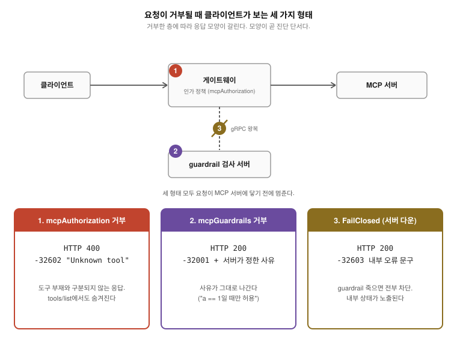
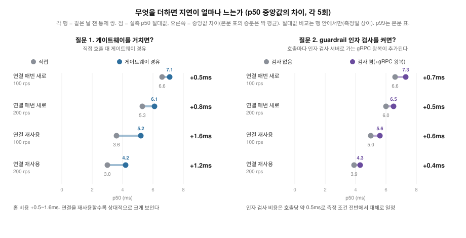

# agentgateway-study: MCP 앞단에서 게이트웨이가 실제로 강제하고 관측하는 것

[English](README.md)

agentgateway를 MCP(Model Context Protocol) 게이트웨이로 쓸 때 문서에 적힌
것과 실제로 강제되고 관측되는 것 사이의 거리를 실측한 연구다. 기능 표가
아니라 동작을 확인했다. 정책(CEL, Common Expression Language 기반 인가)이
무엇을 막고 무엇을 조용히 잘못 막는지, 트레이스가 어디까지 이어지는지,
게이트웨이를 거치는 비용이 얼마인지, 정책으로 안 되는 인자 통제가
무엇으로 되는지를 쟀다.
[gateway-PoC](../gateway-PoC)에서 쓴 "선언 대 실제 강제" 프레임을 MCP
게이트웨이에 적용한 것이다.

agentgateway는 리눅스 재단 산하 Agentic AI Foundation(AAIF)의 호스티드
프로젝트다. 측정 대상은 agentgateway v1.4.1(Kubernetes 모드)이고 백엔드는
[mcp-migration](../mcp-migration)에서 만든 신 스펙(2026-07-28) MCP 서버를
그대로 썼다.

## 요약

- **비용은 작다.** 게이트웨이를 거치는 비용은 p50 +0.5~1.6ms로 도구 호출의
  실제 작업(수십 ms~수 초)에 묻히는 크기이고 인자 검사(guardrail)를 얹는
  비용은 호출당 0.5ms 수준으로 측정한 부하와 연결 방식 전반에서 대체로
  일정하다.
- **대가로 서버가 클라이언트별로 해 줄 수 없는 것을 경로에서 얻는다.** 도구
  노출 통제(목록 필터링), 인자 단위 통제, 서버 수정 없는 분산 트레이싱.
- **단, 일부 정책은 수용되고도 의도대로 강제되지 않는다.** 인자 조건 정책이
  수용된 채 백엔드 전체를 잠그는 것이 이 연구의 핵심 발견이다. 정책은 켠 뒤
  실제 호출로 확인해야 한다.

## 결과

1. **도구 이름 화이트리스트는 호출 차단과 목록 필터링을 다 한다.** echo만
   허용하면 다른 도구 호출은 400으로 거절되고 tools/list에서도 사라진다.
   거절 응답은 인가 오류가 아니라 400 + "Unknown tool"(-32602)이다. 오류
   코드는 MCP가 물려받는 JSON-RPC 표준의 것으로 -32602의 표준 의미는
   "잘못된 인자"라, 권한 거부가 인자 오류의 코드까지 입은 셈이다. 차단된
   도구를 처음부터 없는 것처럼 보이게 하는 의도된 설계다(도구 열거 방지,
   업스트림 #758에서 논의). 대신 클라이언트는 권한 문제와 도구 부재를
   구분할 수 없다.
2. **도구 인자 조건을 쓴 정책은 수용되지만 백엔드 전체를 잠근다.** 이 연구의
   핵심 발견이다. `mcp.tool.arguments.a == 1` 같은 조건이 담긴 정책이 검증을
   통과하고(Accepted) 상태도 정상으로 보고된다. 그러나 인가를 평가하는
   시점의 CEL 컨텍스트에는 도구 인자가 없어 조건이 평가되지 않는다. 규칙
   목록이 화이트리스트라서 결과적으로 조건에 맞는 호출까지 전부 거절되고
   이 규칙 아래에서는 tools/list도 빈 목록을 반환한다. `has(...)` 가드를
   붙이면 잠금은 풀리지만 가드가 모든 호출에서 단락되어 규칙이 이름만으로
   평가되고 인자 조건은 적용되지 않는다(막으려던 a=2도 통과, 실측). 즉 이 정책 경로 안에서는 인자
   통제의 워크어라운드가 없다. 운영자는 인자 통제가 걸렸다고 믿게 되는데
   실제로는 모든 호출이 거절되거나 조건이 사라진 상태다. 업스트림 현황(2026-08-27 기준):
   인가 컨텍스트가 identity 전용인 것 자체는 설계다(정책이 tools/list와
   tools/call에 공통 적용되어 list 시점엔 인자가 존재할 수 없다. 메인테이너가
   #2069에서 개선안과 함께 논의 등록, 결정 대기). 아키텍처 문서에는 이
   한정이 적혀 있으나 사용자용 스키마 문서에는 단계 구분이 없다. 이 간극은
   이 연구가 #3092로 제보했고 그 문서에 경고를 추가하는 커뮤니티
   PR(#3127)이 열려 있다. 이 서술의 적용 범위는 측정 버전 v1.4.1이고
   v1.5.0-beta.1과 main에서도 같은 동작을 확인했다.
3. **정책은 재작명 이전의 원래 이름을 평가하고 재작명 이름 우회는 없다.**
   prefixMode를 켜면 도구가 재작명 이름(접두사가 붙은 이름, 예:
   `mcp-b-80_echo`)으로 노출되는데, 세 모드 모두에서 그 이름으로 차단을
   우회하는 경로는 없었다. 대신 함정이 둘 있다. 하나, 클라이언트가
   tools/list에서 실제로 보는 재작명 이름으로 정책을 쓰면 결과 2와 같은
   전량 차단이 된다. 둘, 정책이 허용한 이름은 백엔드에 없어도 서버까지
   전달되어 게이트웨이 거절(400)이 아니라 200 + isError로 실패한다.
4. **정책 규칙 수는 이 규모에서 지연에 영향이 없다.** 규칙 0, 1, 21개에서
   p50 중앙값이 5.8~7.2ms 범위로 같았고 모든 회차가 목표 rps를 달성했다
   (최저 197.3/200).
5. **traceparent는 게이트웨이를 넘어 이어지고 `_meta`에도 실린다.**
   다운스트림 서버는 클라이언트의 trace-id를 그대로 유지하고 span-id만
   게이트웨이 것으로 바뀐 traceparent를 헤더로 받는다. 같은 값이 MCP 스펙이
   `_meta`에 예약한 자리(`_meta.traceparent`)에도 주입된다(5회 전부). v1.4.1
   문서에서는 이 동작을 찾지 못했다. 측정은 게이트웨이 트레이싱 설정이 없는 조건이다. 트레이싱을
   켠 조건에서 스팬의 부모 관계가 잘못 잡히는 문제는 업스트림 #2904로 보고되어
   수정이 병합됐고 그 수정은 측정 버전(v1.4.1) 이후 릴리스에 실린다.
6. **게이트웨이를 거치는 비용은 연결 방식에 따라 p50 +0.5~1.6ms이고 꼬리
   효과는 연결 방식에 따라 뒤집힌다.** 호출마다 새 연결을 여는 조건에서는
   p50이 0.5~0.8ms 늘고 p99 중앙값은 게이트웨이 쪽이 낮았다. 연결을
   재사용하는 조건에서는 비용이 1.2~1.6ms로 커지고 p99 이점은 사라졌다
   (아래 표). 이 대비가 해석을 지지한다. 게이트웨이의 꼬리 안정 효과는
   연결 폭주를 자기 층이 받아내는 데서 오므로, 클라이언트가 연결을
   재사용하면 홉 추가 비용만 남는다. 전 회차에서 두 경로 모두 오류 0으로
   목표 rps를 유지했다.
7. **인자 단위 통제는 mcpGuardrails(외부 gRPC 정책 서버)로 가능하다.**
   "get-sum은 a==1일 때만 허용"을 강제하는 최소 서버로 a=1 통과, a=2 거부,
   무관 도구 통과를 확인했다. 게이트웨이가 인자를 gRPC 요청에 그대로 실어
   보낸다. 거부는 인가와 달리 HTTP 200 + JSON-RPC 오류에 서버가 정한 사유가
   그대로 나가고 서버가 죽으면 FailClosed 기본값이 tools/call을 전부 막는다.
   FailOpen이면 문서대로 통과한다. guardrail 홉의 비용은 p50 호출당
   +0.4~0.7ms로 측정한 부하와 두 연결 방식 전반에서 대체로 일정하다(전 셀
   게이트웨이 오류 0, 아래 표). `Full` 페이즈 설정은 요청과 응답 본문을 모두 gRPC
   서버에 태우는 것까지 확인했다.

## 정책을 쓰는 운영자가 알아야 할 것

| 하려는 것 | 되는가 | 주의 |
|---|---|---|
| 도구 이름 화이트리스트 | 된다 | 목록 필터링까지 같이 된다. 거절이 인가 오류가 아니라 400 + "Unknown tool"(-32602)로 온다 |
| 도구 인자 기반 통제 ("delete는 막되 prod만") | 정책으로는 안 되고 guardrail로는 된다 | 정책은 수용된 채 백엔드가 잠기고 `has(...)` 가드는 조건을 잃는다. mcpGuardrails는 gRPC 서버를 직접 구현해야 하고 호출당 p50 0.5ms 수준이 더 들며 거부가 200 + JSON-RPC 오류로 나간다 |
| 재작명(prefixMode) 환경에서 정책 작성 | 된다 | 반드시 원래 이름으로 쓴다. 클라이언트가 보는 재작명 이름으로 쓰면 전량 차단된다 |
| 규칙을 늘리며 지연 걱정 | 걱정 없음 | 21개까지 차이 없음 |
| 분산 트레이싱 연계 | 된다 | 헤더와 `_meta` 양쪽으로 전파된다(트레이싱 미설정 조건에서 확인) |

그림의 오류 코드는 JSON-RPC 표준 체계다. -32602(잘못된 인자)와
-32603(내부 오류)은 표준 코드이고 -32001은 표준이 구현체 몫으로 비워 둔
대역(-32000~-32099)에서 agentgateway가 정한 값이라 범용 JSON-RPC 지식만으로는
해석되지 않는다.

이 응답을 읽는 쪽은 대부분 사람이 아니라 에이전트 루프다. LLM이 거부
텍스트를 도구 호출 결과로 읽고 다음 행동을 정하므로, 도구 부재와 구분되지
않는 형태 1을 받은 에이전트는 도구가 없다고 판단해 우회로 갈 수 있고
형태 2의 사유 문자열은 인자를 고쳐 재시도할 근거가 된다. 그래서 guardrail의
거부 사유는 LLM이 읽는 입력, 사실상 프롬프트로 작동한다. 에이전트 행동
자체는 이 연구의 측정 범위 밖이라 이 문단은 해석이다.

## 수치

측정 환경: VirtualBox 3노드 Kubernetes v1.36.2(맥북 프로 M4 Pro), agentgateway
v1.4.1, 백엔드 레플리카 1, echo 도구, 30초 런. 연결 방식과 쿨다운은 표마다
명기한다(규칙 수 측정은 회차 간 60초, A/B와 guardrail은 셀 간 180초).
절대 수치는 가상 환경 값이라 상대 비교로만 읽는다.

정책 규칙 수에 따른 지연(각 5회 중앙값):

| 규칙 수 | 100rps p50 | 200rps p50 |
|---|---|---|
| 0 | 7.2ms | 5.8ms |
| 1 | 6.9ms | 6.4ms |
| 21 | 6.9ms | 6.3ms |

게이트웨이 유무 비교(각 5회 중앙값). 게이트웨이 컨트롤 플레인과 프록시를
설치한 채로 두 경로를 모두 재서 자원 조건을 동일하게 맞췄고 두 경로의
차이는 부하 생성기의 대상 주소뿐이다. 두 경로는 회차 안에서 교대로 쟀다:

| 경로 | 목표 rps | 달성 rps | p50 | p99 | 오류 |
|---|---|---|---|---|---|
| 직접 | 100 | 100.0 | 6.6ms | 21.6ms | 0 |
| 게이트웨이 | 100 | 100.0 | 7.1ms | 17.9ms | 0 |
| 직접 | 200 | 200.0 | 5.3ms | 23.2ms | 0 |
| 게이트웨이 | 200 | 200.0 | 6.1ms | 12.6ms | 0 |

같은 비교를 close 모드 대신 연결 재사용으로 하면:

| 경로 | 목표 rps | 달성 rps | p50 | p99 | 오류 |
|---|---|---|---|---|---|
| 직접 | 100 | 100.0 | 3.6ms | 9.7ms | 0 |
| 게이트웨이 | 100 | 100.0 | 5.2ms | 17.4ms | 0 |
| 직접 | 200 | 200.0 | 3.0ms | 10.2ms | 0 |
| 게이트웨이 | 200 | 200.0 | 4.2ms | 12.8ms | 0 |

close 모드에서 게이트웨이 경로의 p99가 낮은 것, 그리고 재사용에서 그
이점이 사라지는 것은 연결 폭주를 게이트웨이 계층이 받아내기 때문으로
보이나, 원인을 소스 코드에서 확인하지는 않았다.

guardrail 오버헤드. 게이트웨이와 guardrail 파드를 두 조건 모두 설치한 채
tools/call을 gRPC 서버로 태우는 정책의 유무만 바꿨고 시간 드리프트가
증분에 섞이지 않게 각 회차에서 off와 on을 인접 교대(홀수 회차 off 먼저,
짝수 회차 on 먼저)로 쟀다. 각 5쌍:

| 연결 | 목표 rps | 달성 rps | off p50 | on p50 | off p99 | on p99 | 짝 증분 평균 |
|---|---|---|---|---|---|---|---|
| 매번 새로 | 100 | 100.0 | 6.6ms | 7.3ms | 16.5ms | 17.7ms | +0.66ms (sd 0.09) |
| 매번 새로 | 200 | 200.0 | 6.0ms | 6.5ms | 12.6ms | 12.7ms | +0.46ms (sd 0.05) |
| 매번 새로 | 400 | 239~315 | 3.8ms | 4.3ms | 22.0ms | 37.0ms | +0.56ms (sd 0.05) |
| 재사용 | 100 | 100.0 | 5.0ms | 5.6ms | 14.4ms | 20.0ms | +0.38ms (sd 0.36) |
| 재사용 | 200 | 200.0 | 3.9ms | 4.3ms | 13.5ms | 12.6ms | +0.40ms (sd 0.19) |

400rps 행에는 단서가 붙는다. 그 조건에서 부하 생성기가 포화해 요청의 약
16%를 버렸고(달성 239~315rps), 따라서 그 행은 깨끗한 400rps가 아니라
포화 상태의 고처리량 조건을 잰 것이다. 그 조건에서도 짝 증분은 다른
셀과 같았다. 열린 관찰 하나 더. 여러 표에서 rps가 오를수록 p50이
내려가는데(여기서도 6.6 -> 6.0 -> 3.8ms) 동시성 증가에 따른 배칭이 그럴듯한
원인이나 조사하지는 않았다.

읽기는 세 가지다. 첫째, 인자 검사의 지연 비용은 **호출당 +0.4~0.7ms이고
측정한 부하와 두 연결 방식 전반에서 대체로 일정하다**. 둘째, 부하를
200rps에서 달성 기준 239~315rps로 올려도 증분이 늘지 않아 큐잉과 결이
다르다. 셋째, 이 크기와 상수성은 귀속
실측과 정합한다. close 모드 3,000 호출 동안 검사 서버로 새로 열린 TCP
연결은 무부하 기준선과 같은 1개였고 v1.4.1 소스도 검사를 공유 클라이언트
풀로 보내는 구조라서, 이 비용은 호출마다 채널을 새로 여는 비용이 아니라
**유지된 gRPC 채널 위의 왕복 한 번**이다.

측정 설계 기록 하나. 교대 이전의 순차 측정(off 팔 전체를 잰 뒤 on 팔)은
"매번 새로 +1.0~1.1ms, 재사용 0과 구분 불가"라는 다른 그림을 냈는데, 교대
측정에서 재현되지 않았다. 팔 사이의 시간 드리프트가 한쪽 증분을 부풀리고
다른 쪽을 가린 것으로 판정하며 위 교대 수치를 정본으로 삼는다. off/on
비교처럼 차이가 1ms 아래인 측정은 팔 순차가 아니라 쌍 교대로 설계해야
한다는 것이 이 기록의 교훈이다.

## 무엇을 측정했나

- **정책 강제(P0~P4)**: 정책 없음 기준선, 화이트리스트 강제와 목록 필터링,
  인자 조건 정책의 세 프로브(조건 참, 조건 거짓, 무관 도구), prefixMode 세
  모드 x 정책 대상 이름 2종 x 호출 이름 4종 전조합, 규칙 수 x 처리량 x 5회.
  보강 프로브로 인자 규칙 아래의 tools/list와 `has(...)` 가드 2종까지 확인.
- **관측(T1/T2)**: 게이트웨이 뒤에 탭 프록시를 두고 다운스트림이 받는
  traceparent 헤더와 `params._meta`를 원문으로 확인(5회).
- **게이트웨이 유무 비교(A/B)**: 같은 백엔드에 대상 주소만 바꿔 20셀,
  이어서 같은 20셀을 close 대신 연결 재사용으로.
- **인자 통제 대안 경로(축 3)**: ExtMcp gRPC 최소 정책 서버(`k8s/guardrail/`)로
  인자 조건 강제, 거부 형태, FailClosed와 FailOpen 동작, `Full` 페이즈의
  요청과 응답 라우팅, guardrail 홉의 지연 오버헤드를 확인.
- **리플레이**: 정책과 관측 하네스 전체를 한 번 더 재실행해 결과 1~5가
  모순 없이 재현됨을 확인.
- 측정 무결성 기록 둘. 규칙 수 측정 도중 실행 프로세스가 외부 요인으로
  종료되어 잔여 6셀을 게이트웨이와 정책 구성을 유지한 채 이어 측정했다.
  그리고 트레이스 전파의 첫 판정은 프로브 도구의 결함으로 생긴 허위
  음성이었는데, 결함을 고치고 다시 재니 판정이 "전파함"으로 뒤집혔다.
  두 이력 모두 원자료와 함께 내부 기록에 남겼다.

## 한계

- MCP 표면만 쟀다. 같은 게이트웨이가 A2A, LLM 추론, REST, gRPC도 받지만
  그 경로들은 시험하지 않았다.
- 시험 대상이 백엔드 1종, 도구 8개로 좁다. 대형 도구 집합에서의 목록 필터링
  비용은 재지 않았다.
- 인자 단위 통제의 대안 경로 중 mcpGuardrails는 동작을 검증했다(결과 7).
  extAuthz와 extProc 계열은 시험하지 않았다.
- MCP 표면 안에서도 인증(MCP Auth)은 범위 밖이다.
- 절대 지연 수치는 VirtualBox 환경 값이다.
- 트레이싱을 켠 조건(스팬 내보내기)은 측정하지 않았다.

## 재현

`harness/run_axes.sh`(정책과 관측), `harness/t1p3_addendum.sh`(보강),
`harness/run_ab.sh`(게이트웨이 유무 비교), `harness/gr_matrix.sh`(guardrail
오버헤드, 교대)를 순서대로 실행한다. guardrail 정책 서버는
`k8s/guardrail/`에 있다. 측정 원자료(`runs/`)는 이 저장소에 포함하지
않는다. 발행 수치는 위 표가 전부 담고 있고 직접 측정하면
`harness/chart.py`가 원자료에서 그림을 재생성한다. 전제는
[mcp-migration](../mcp-migration)의 클러스터와 신 스펙 서버 배포다.
게이트웨이 설치와 제거는 mcp-migration의
`studies/stateless-scaleout/k8s/agentgateway/` 스크립트를 재사용한다.
각 스크립트는 측정 후 게이트웨이를 제거해 클러스터를 원래 상태로 되돌린다.

## 관련 자료

- 벤더 성능 벤치마크: agentgateway 공식 블로그의 agentgateway 대 LiteLLM
  비교(2026-08-13). 프록시 처리량과 자원을 다루며 이 연구와 축이 다르다.
  이 연구는 성능 경쟁 비교가 아니라 정책과 관측의 실제 동작을 다룬다.
- 업스트림 이슈: #758(거절 형태 논의), #2713(인가 컨텍스트의 이름 불일치),
  #2904(트레이싱 활성 조건의 스팬 부모 결함, 수정 병합됨). 결과 2는 이 연구가
  [#3092](https://github.com/agentgateway/agentgateway/issues/3092)로 제보했다.
